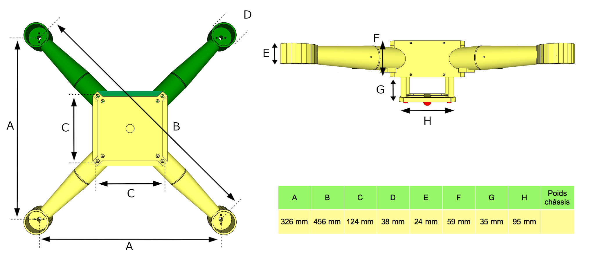

L'autonomie en vol d'un drone peut varier en fonction de plusieurs critères comme son poids, sa taille, les hélices, la batterie, les rmoteurs, la consommation des composants électroniques etc. 

Bref autant de critères qui selon la conception peuvent influer sur l'autonomie de la batterie et par conséquence sur le temps de vol. Je réalise ici quelques tests de configurations d'un drone de type quadcopter entièrement imprimé en 3D afin de calculer le temps de vol. 

Pour cela nous allons faire varier principalement les trois critères suivants : la batterie, les moteurs et les hélices, bien évidemment le poids du drone sera aussi variable selon les choix des conceptions. Commençons par analyser les caractéristiques physiques et techniques du drone.

## Dimensions et poids du châssis à vide :



## Caractéristiques techniques :

Ce drone est équipé d'un contrôleur de vol BeagleBone Blue. BeagleBone Blue est un mini ordinateur monocarte Open Source sous Linux spécialement conçu pour des applications embarquées. Il est équipé des systèmes de communication sans fil standard Wi-Fi et Bluetooth 4.0 ainsi que des connecteurs dédiés pour d'autres interfaces telles que UART, SPI, radio DSM2, et GPS. Il embarque également une unité de mesure inertielle indispensable pour l'orientation d'un drone comportant un accéléromètre, un gyroscope et une boussole. Voici la liste des composants électroniques embarqués dans le drone :

*   Contrôleur de vol
*   Moteur Brushless x 4
*   ESC x 4
*   Batterie LiPo 11.1 V
*   Ubec 5V3A
*   Module GPS
*   Recepteur radio
*   Radio 3DR
*   Raspberry Pi Zero W couplé en liaison série à un microcontrôleur Atmega328(*)

```
(*) Le Raspberry Pi Zero W couplé en liaison série à un microcontrôleur Atmega328 mesure 
l'état actuel de la batterie tout au long du test. Les mesures stocké dans un fichier 
sont ensuite transmis à la station de contrôle au sol.
```


*image_caption*

## Stratégie de tests :

Comme spécifié en introduction, la réalisation de ces tests en vol est définit par le type de batterie, les moteurs et les hélices. Chaque test représente un scénario décrit en trois steps de la manière suivante :

*   Step 1 : Init scenario (LiPo à 100%)
    * démarrage en mode ALTITUDE HOLD 
*   Step 2 : Start scenario
    * décollage et maintient de l'altitude à 50% du Throttle
*   Step 3 : End scenario (LiPo ~30%)
    * attérissage du drone causé par la décharge de la batterie ~30% (*)

```
(*) Afin de préserver la longévité d'une batterie LiPo il est vivement recommendé de ne 
pas descendre en dessous de 30% de décharge.
```

## Description des scénarios :

Liste des éléments utilisés pour chaque scénario :

*   Batteries 11.1 V :
    *  Bat 1 : 2200 mAh 35C
    *  Bat 2 : 2200 mAh 50C
    *  Bat 3 (Bat 1 + Bat 2) : 4400 mAh

*   Moteurs : 
    *  Mot 1 : 2212 920 KV (22 mm diametre stator, 12 mm longeur stator, 920 rpm/V)
    *  Mot 2 : 2212 980 KV
    *  Mot 3 : 2212 2200 KV

*   Hélices :
    * Hel 1 : 9443 (9.4 inches longeur, 4.3 inches pitch)
    * Hel 2 : 1038
    * Hel 3 : 1050
    * Hel 4 : 1145

| Scénarios | Batteries | Moteurs   | Hélices   | Poids total     | % LiPo Step 1 | % LiPo Step 3     | Temps de vol      |
|:----------|:----------|:----------|:----------|:----------------|:--------------|:------------------|:------------------| 
| 1         | Bat 1     | Mot 1     | Hel 1     |        -        |      99%      |         -         |         -         |
| 2         | Bat 1     | Mot 1     | Hel 2     |                 |      99%      |                   |                   |
| 3         | Bat 1     | Mot 1     | Hel 3     |                 |      99%      |                   |                   |
| 4         | Bat 1     | Mot 1     | Hel 4     |                 |      99%      |                   |                   |
| 5         | Bat 1     | Mot 2     | Hel 1     |                 |      99%      |                   |                   |
| 6         | Bat 1     | Mot 2     | Hel 2     |                 |      99%      |                   |                   |
| 7         | Bat 1     | Mot 2     | Hel 3     |                 |      99%      |                   |                   |
| 8         | Bat 1     | Mot 2     | Hel 4     |                 |      99%      |                   |                   |
| 9         | Bat 1     | Mot 3     | Hel 1     |                 |      99%      |                   |                   |
| 10        | Bat 1     | Mot 3     | Hel 2     |                 |      99%      |                   |                   |
| 11        | Bat 1     | Mot 3     | Hel 3     |                 |      99%      |                   |                   |
| 12        | Bat 1     | Mot 3     | Hel 4     |                 |      99%      |                   |                   |
| 13        | Bat 2     | Mot 1     | Hel 1     |                 |      99%      |                   |                   |
| 14        | Bat 2     | Mot 1     | Hel 2     |                 |      99%      |                   |                   |
| 15        | Bat 2     | Mot 1     | Hel 3     |                 |      99%      |                   |                   |
| 16        | Bat 2     | Mot 1     | Hel 4     |                 |      99%      |                   |                   |
| 17        | Bat 2     | Mot 2     | Hel 1     |                 |      99%      |                   |                   |
| 18        | Bat 2     | Mot 2     | Hel 2     |                 |      99%      |                   |                   |
| 19        | Bat 2     | Mot 2     | Hel 3     |                 |      99%      |                   |                   |
| 20        | Bat 2     | Mot 2     | Hel 4     |                 |      99%      |                   |                   |
| 21        | Bat 2     | Mot 3     | Hel 1     |                 |      99%      |                   |                   |
| 22        | Bat 2     | Mot 3     | Hel 2     |                 |      99%      |                   |                   |
| 23        | Bat 2     | Mot 3     | Hel 3     |                 |      99%      |                   |                   |
| 24        | Bat 2     | Mot 3     | Hel 4     |                 |      99%      |                   |                   |
| 25        | Bat 3     | Mot 1     | Hel 1     |                 |      99%      |                   |                   |
| 26        | Bat 3     | Mot 1     | Hel 2     |                 |      99%      |                   |                   |
| 27        | Bat 3     | Mot 1     | Hel 3     |                 |      99%      |                   |                   |
| 28        | Bat 3     | Mot 1     | Hel 4     |                 |      99%      |                   |                   |
| 29        | Bat 3     | Mot 2     | Hel 1     |                 |      99%      |                   |                   |
| 30        | Bat 3     | Mot 2     | Hel 2     |                 |      99%      |                   |                   |
| 31        | Bat 3     | Mot 2     | Hel 3     |                 |      99%      |                   |                   |
| 32        | Bat 3     | Mot 2     | Hel 4     |                 |      99%      |                   |                   |
| 33        | Bat 3     | Mot 3     | Hel 1     |                 |      99%      |                   |                   |
| 34        | Bat 3     | Mot 3     | Hel 2     |                 |      99%      |                   |                   |
| 35        | Bat 3     | Mot 3     | Hel 3     |                 |      99%      |                   |                   |
| 36        | Bat 3     | Mot 3     | Hel 4     |                 |      99%      |                   |                   |


type de vol etc. sa dimension Text can be **bold**, _italic_, or ~~strikethrough~~.

[Link to another page](./another-page.html).

There should be whitespace between paragraphs.

There should be whitespace between paragraphs. We recommend including a README, or a file with information about your project.

# Header 1

This is a normal paragraph following a header. GitHub is a code hosting platform for version control and collaboration. It lets you and others work together on projects from anywhere.

## Header 2

> This is a blockquote following a header.
>
> When something is important enough, you do it even if the odds are not in your favor.

### Header 3

```js
// Javascript code with syntax highlighting.
var fun = function lang(l) {
  dateformat.i18n = require('./lang/' + l)
  return true;
}
```

```ruby
# Ruby code with syntax highlighting
GitHubPages::Dependencies.gems.each do |gem, version|
  s.add_dependency(gem, "= #{version}")
end
```

#### Header 4

*   This is an unordered list following a header.
*   This is an unordered list following a header.
*   This is an unordered list following a header.

##### Header 5

1.  This is an ordered list following a header.
2.  This is an ordered list following a header.
3.  This is an ordered list following a header.

###### Header 6

| head1        | head two          | three |
|:-------------|:------------------|:------|
| ok           | good swedish fish | nice  |
| out of stock | good and plenty   | nice  |
| ok           | good `oreos`      | hmm   |
| ok           | good `zoute` drop | yumm  |

### There's a horizontal rule below this.

* * *

### Here is an unordered list:

*   Item foo
*   Item bar
*   Item baz
*   Item zip

### And an ordered list:

1.  Item one
1.  Item two
1.  Item three
1.  Item four

### And a nested list:

- level 1 item
  - level 2 item
  - level 2 item
    - level 3 item
    - level 3 item
- level 1 item
  - level 2 item
  - level 2 item
  - level 2 item
- level 1 item
  - level 2 item
  - level 2 item
- level 1 item

### Small image


### Large image


### Definition lists can be used with HTML syntax.

<dl>
<dt>Name</dt>
<dd>Godzilla</dd>
<dt>Born</dt>
<dd>1952</dd>
<dt>Birthplace</dt>
<dd>Japan</dd>
<dt>Color</dt>
<dd>Green</dd>
</dl>

```
Long, single-line code blocks should not wrap. They should horizontally scroll if they are too long. This line should be long enough to demonstrate this.
```

```
The final element.
```
